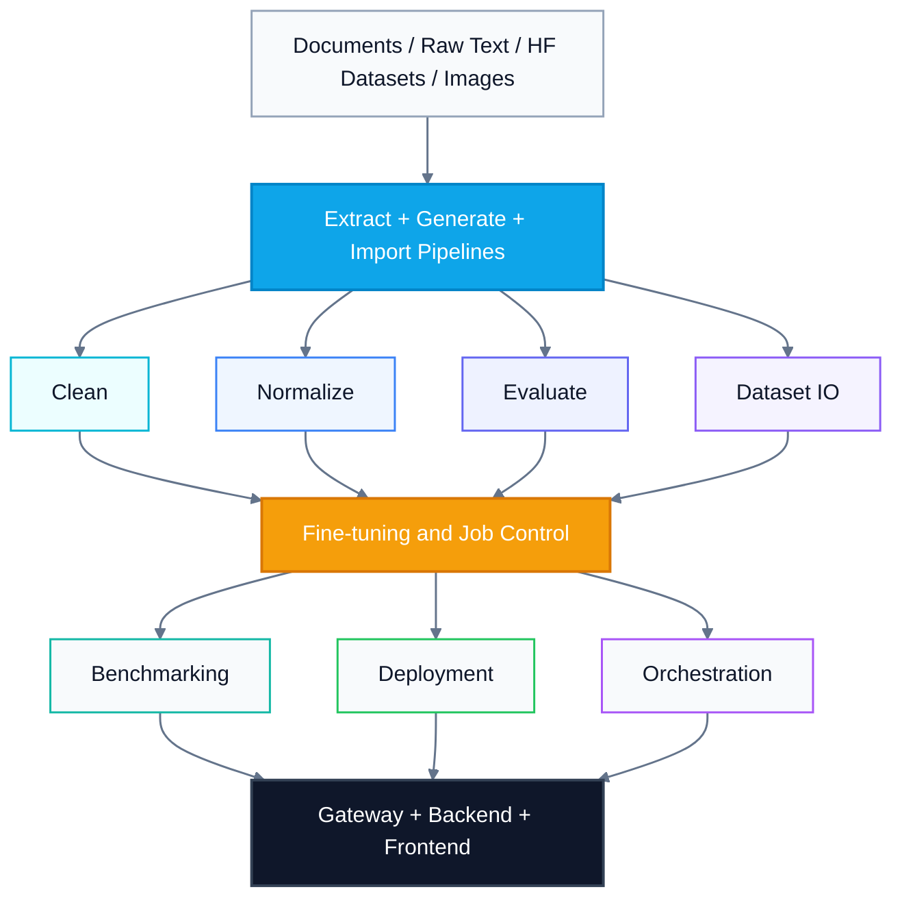

# MCP Tuna

<!-- mcp-name: io.github.deduu/mcp-tuna -->

<p align="center">
  
</p>

<p align="center">
  <strong>MCP-native platform for dataset generation, evaluation, fine-tuning, deployment, orchestration, and operator-facing tooling.</strong>
</p>

<p align="center">
  <a href="#quick-start">Quick Start</a> |
  <a href="#platform-surfaces">Platform Surfaces</a> |
  <a href="#gateway-namespaces">Gateway Namespaces</a> |
  <a href="#mcp-client-setup">MCP Client Setup</a> |
  <a href="#development">Development</a>
</p>

<p align="center">
  
  
  
  
  
</p>

MCP Tuna is an end-to-end post-training platform for text and vision-language models. It combines MCP servers, a unified gateway, a React control plane, an OpenAI-compatible chat backend, dataset persistence, optional object storage, fine-tuning pipelines, evaluation workflows, and deployment tooling in one repository.

The codebase is designed to work in two complementary modes:

- as a serious MCP server suite for coding agents and tool-calling runtimes
- as a human-operated local platform for inspecting tools, datasets, jobs, deployments, and evaluation runs

## Why This Repo Exists

Most fine-tuning stacks fragment quickly: one repo for synthetic data, another for cleaning, a notebook for training, a separate deployment service, and ad hoc glue for agents. MCP Tuna keeps those steps in one place and exposes them through a stable MCP-first surface.

That matters for both humans and agents:

- agents get one discovery surface instead of fragile handwritten tool wrappers
- operators get a real UI instead of raw JSON and shell history
- teams can move between local experimentation, repeatable workflows, and tool-driven automation without switching stacks

## What MCP Tuna Covers

| Area | What you can do |
|------|------------------|
| Data ingestion and generation | Load documents, generate SFT/DPO/GRPO/KTO data, and import Hugging Face datasets |
| Dataset preparation | Clean, normalize, validate, preview, split, merge, and persist datasets |
| Quality and benchmarking | Score dataset quality, benchmark models, run judge-based evaluation, and export reports |
| Fine-tuning | Run synchronous or async LoRA training, curriculum flows, sequential multi-stage training, adapter merge, and GGUF export |
| Multimodal/VLM | Train VLM SFT jobs, run multimodal inference, deploy VLM runtimes, and evaluate multimodal responses |
| Deployment | Serve trained models as MCP servers or REST APIs and chat against live deployments |
| Workflow orchestration | Run guided end-to-end pipelines and collect orchestration training data from trajectories |
| Runtime and persistence | Persist jobs, deployments, conversations, datasets, and artifacts to PostgreSQL, with optional S3-compatible blob sync |

## Highlights

- Unified MCP gateway with 17 namespaces and 120+ tool entry points defined in the gateway source.
- Dedicated React control plane for Tools, Chat, Datasets, Training, Deployments, Evaluation, Pipeline, and Settings.
- Built-in multimodal path with `vlm_sft` dataset handling, VLM training, VLM deployment, and multimodal judge flows.
- Modular packaging: run the whole platform or install only the extras you need.
- Split server entry points for teams that want capability-specific MCP surfaces instead of one gateway.
- Bundled MCP client setup generator for VS Code, Claude Desktop, Claude Code, and Cursor.

## Platform Surfaces

| Surface | Purpose | Entry point |
|---------|---------|-------------|
| Unified MCP gateway | Primary MCP surface across all tool families | `mcp-tuna-gateway` |
| Split MCP servers | Smaller, capability-specific servers | `mcp-tuna-data`, `mcp-tuna-eval`, `mcp-tuna-model-eval`, `mcp-tuna-train`, `mcp-tuna-host`, `mcp-tuna-orchestrate` |
| Frontend control plane | Human-facing UI for operations and debugging | `frontend/` |
| FastAPI backend | OpenAI-compatible `/v1/chat/completions` endpoint and app runtime | `app.main:app` |
| Local chat CLI | Interactive REPL for direct or deployed model chat | `mcp-tuna-chat` |
| MCP config generator | Writes client configs for supported MCP hosts | `mcp-tuna-setup` |

## Architecture



This platform view shows the repo's end-to-end flow from ingestion through dataset prep, fine-tuning control, downstream runtime surfaces, and the final gateway/backend/frontend layer.

## Gateway Namespaces

The unified gateway is the core product surface. It groups tools by namespace so clients can discover capability families instead of traversing a flat, unstructured tool list.

| Namespace | Tool count | Responsibility |
|-----------|------------|----------------|
| `system` | 13 | Machine readiness, diagnostics, environment setup, and training prescription |
| `file` | 3 | Backend-visible file browsing and uploads |
| `extract` | 1 | Document loading |
| `generate` | 8 | Synthetic dataset generation from documents, text, pages, or Hugging Face datasets |
| `clean` | 4 | Deduplication, schema checks, and weak-row removal |
| `normalize` | 4 | Field alignment and text normalization |
| `evaluate` | 6 | Dataset scoring, statistics, and quality filtering |
| `evaluate_model` | 4 | Model benchmarking and result export |
| `dataset` | 8 | Save, load, preview, inspect, split, merge, and list datasets |
| `finetune` | 23 | SFT/DPO/GRPO/KTO/VLM training, async jobs, curriculum, sequential chaining, adapter merge, and GGUF export |
| `test` | 3 | Direct inference, model comparison, and VLM inference |
| `validate` | 6 | Dataset validation and model discovery helpers |
| `host` | 11 | MCP/API deployment, health checks, deployment inventory, and chat |
| `workflow` | 11 | Guided multi-step pipeline execution and workflow job management |
| `orchestration` | 4 | Problem generation, trajectory collection, training-data assembly, and orchestration training |
| `judge` | 10 | Pointwise, pairwise, rubric, batch, and multimodal judge evaluation |
| `ft_eval` | 4 | Fine-tune specific evaluation, summaries, and export |

For a namespace-by-namespace catalog of representative flows, see [docs/tool-catalog.md](docs/tool-catalog.md).

## Frontend

The frontend is a working operator UI, not a placeholder shell.

| Page | What it covers |
|------|-----------------|
| Dashboard | Tool counts, system status, and fast navigation |
| Tools | Schema-driven MCP tool explorer and execution forms |
| Chat | Tool-aware chat, deployment chat, and compare flows |
| Pipeline | Guided and custom orchestration forms |
| Datasets | Import, preview, clean, normalize, split, merge, evaluate, and VLM dataset authoring |
| Training | Technique selection, capability-aware forms, and job tracking |
| Deployments | Launch, inspect, test, and chat with running deployments |
| Evaluation | Single eval, compare, benchmark, judge, and fine-tune evaluation flows |
| Settings | Gateway connectivity, environment, diagnostics, storage, and maintenance actions |

Key UI traits:

- tool forms are generated from MCP schemas
- path fields can browse backend-visible directories
- training options are gated by available backend capabilities
- multimodal chat and judge paths activate automatically when image blocks are present

## UI Preview

<p align="center">
  
</p>

<p align="center">
  Tools, Training, Evaluation, and Deployments from the local control plane.
</p>

## Quick Start

### Prerequisites

- Python 3.11+
- `uv` for the recommended Python workflow
- `npm` for the frontend
- GPU plus CUDA-compatible PyTorch environment if you plan to run local training or hosted inference

### 1. Clone and install

```bash
git clone https://github.com/deduu/MCP-Tuna.git
cd MCP-Tuna
uv sync --extra all
```

Optional but recommended:

```bash
cp .env.example .env
```

### 2. Run the unified gateway for MCP clients

HTTP mode:

```bash
uv run mcp-tuna-gateway http --port 8000
```

stdio mode:

```bash
uv run mcp-tuna-gateway
```

### 3. Run the full local platform

For local UI development, the frontend expects:

- FastAPI backend on `http://127.0.0.1:8000`
- MCP gateway on `http://127.0.0.1:8002`
- Vite frontend on `http://127.0.0.1:5173`

Start them in separate terminals:

```bash
uv run uvicorn app.main:app --reload --port 8000
uv run python scripts/run_gateway.py http --port 8002
npm --prefix frontend install
npm --prefix frontend run dev
```

### 4. Run the packaged local stack with Docker Compose

```bash
docker compose up --build -d
```

`docker-compose.yml` starts:

- PostgreSQL with pgvector on `55432`
- MinIO on `9000` with console on `9001`
- FastAPI backend on `8000`
- the unified gateway on `8002`
- the frontend on `5173`

Open:

- frontend: `http://127.0.0.1:5173`
- backend: `http://127.0.0.1:8000`
- gateway: `http://127.0.0.1:8002`

## Typical Workflows

### Build a training dataset from documents

1. Load or generate with `extract.load_document` or `generate.from_document`.
2. Clean with `clean.dataset`.
3. Normalize with `normalize.dataset`.
4. Score and filter with `evaluate.dataset` and `evaluate.filter_by_quality`.
5. Persist with `dataset.save`.

### Validate a machine before training

1. Run `system.check_resources`.
2. Run `system.preflight_check`.
3. Use `system.prescribe` or `system.auto_prescribe` for recommended settings.

### Train and deploy a model

1. Validate the dataset with `validate.schema`.
2. Launch `finetune.train_async` or a technique-specific training tool.
3. Monitor with `finetune.job_status` or `finetune.list_jobs`.
4. Deploy with `host.deploy_mcp`, `host.deploy_api`, `host.deploy_vlm_mcp`, or `host.deploy_vlm_api`.

### Run a multimodal flow

1. Create a canonical `vlm_sft` dataset from the Datasets page or a JSONL manifest.
2. Train with `finetune.train_vlm_async`.
3. Test with `test.vlm_inference`.
4. Evaluate with `judge.evaluate_vlm` or `judge.evaluate_vlm_batch`.
5. Serve with `host.deploy_vlm_api` or `host.deploy_vlm_mcp`.

### Benchmark or judge model outputs

1. Use `evaluate_model.batch` for benchmark-style scoring over a dataset.
2. Use `judge.evaluate`, `judge.compare_pair`, or their VLM variants for LLM-as-a-judge workflows.
3. Export with `evaluate_model.export`, `judge.export`, or `ft_eval.export`.

## Copy-Paste MCP Examples

These examples assume the gateway is available at `http://127.0.0.1:8002/mcp`. If you are running the gateway standalone without the FastAPI backend on the same port, `8000` is also valid.

### Check whether a machine can train

```bash
curl -s http://127.0.0.1:8002/mcp \
  -H "Content-Type: application/json" \
  -d '{
    "jsonrpc":"2.0",
    "id":"check-resources",
    "method":"tools/call",
    "params":{"name":"system.check_resources","arguments":{}}
  }'
```

### Generate SFT data from a document

```bash
curl -s http://127.0.0.1:8002/mcp \
  -H "Content-Type: application/json" \
  -d '{
    "jsonrpc":"2.0",
    "id":"generate-doc",
    "method":"tools/call",
    "params":{
      "name":"generate.from_document",
      "arguments":{
        "technique":"sft",
        "file_path":"uploads/example.md"
      }
    }
  }'
```

### Start async fine-tuning

```bash
curl -s http://127.0.0.1:8002/mcp \
  -H "Content-Type: application/json" \
  -d '{
    "jsonrpc":"2.0",
    "id":"train-async",
    "method":"tools/call",
    "params":{
      "name":"finetune.train_async",
      "arguments":{
        "dataset_path":"output/my_dataset.jsonl",
        "output_dir":"output/my_run",
        "base_model":"meta-llama/Llama-3.2-3B-Instruct"
      }
    }
  }'
```

### Run a guided end-to-end workflow

```bash
curl -s http://127.0.0.1:8002/mcp \
  -H "Content-Type: application/json" \
  -d '{
    "jsonrpc":"2.0",
    "id":"guided-pipeline",
    "method":"tools/call",
    "params":{
      "name":"workflow.guided_pipeline",
      "arguments":{
        "goal":"Generate a clean SFT dataset from a markdown document and prepare it for fine-tuning",
        "file_path":"uploads/example.md",
        "base_model":"meta-llama/Llama-3.2-3B-Instruct"
      }
    }
  }'
```

## Installation Profiles

Install only what you need:

| Extra | What it enables |
|-------|------------------|
| `data` | Document ingestion and synthetic dataset generation |
| `eval` | Dataset quality scoring and filtering |
| `model-eval` | Model benchmarking and export |
| `model-eval-full` | `model-eval` plus BERTScore |
| `training` | Local LoRA training and training utilities |
| `hosting` | Local model deployment and chat services |
| `orchestration` | Trajectory generation and orchestration data workflows |
| `export` | GGUF export |
| `backend` | FastAPI backend, SQLAlchemy, async PostgreSQL, object storage support |
| `memory` | Chroma-backed memory integrations |
| `retrieval` | FAISS and BM25 retrieval |
| `tracing` | Auditi tracing |
| `dev` | Tests and linting |
| `all-servers` | All gateway and split-server capability groups |
| `all` | Full local development environment |

Examples:

```bash
pip install "mcp-tuna[data]"
pip install "mcp-tuna[training,hosting]"
pip install "mcp-tuna[all]"
```

## Runtime Configuration

Core environment variables are loaded from `.env` if present.

| Variable | Purpose |
|----------|---------|
| `OPENAI_API_KEY` | OpenAI-backed generation, evaluation, and judge flows |
| `ANTHROPIC_API_KEY` | Anthropic provider access |
| `GOOGLE_API_KEY` | Google provider access |
| `HF_TOKEN` | Hugging Face model download, gated model access, and upload workflows |
| `UPLOAD_ROOT` | Root directory for uploaded documents and images |
| `PERSISTENCE_ENABLED` | Enable PostgreSQL-backed job, dataset, deployment, conversation, and artifact persistence |
| `DB_DRIVER`, `DB_HOST`, `DB_PORT`, `DB_NAME`, `DB_USER`, `DB_PASSWORD` | Database connection settings |
| `OBJECT_STORAGE_ENABLED` | Enable S3-compatible object storage sync for artifacts and datasets |
| `OBJECT_STORAGE_*` | Endpoint, credentials, bucket, region, prefix, and public URL settings |
| `MCP_TUNA_GATEWAY_URL` | URL used by the app runtime to auto-connect agents to the gateway |

Use `.env.example` as the starting point for local configuration.

## Available Commands

| Command | Purpose |
|---------|---------|
| `mcp-tuna-gateway` | Unified gateway over stdio or HTTP |
| `mcp-tuna-data` | Data-prep focused MCP server |
| `mcp-tuna-eval` | Dataset evaluation MCP server |
| `mcp-tuna-model-eval` | Model evaluation MCP server |
| `mcp-tuna-train` | Training MCP server |
| `mcp-tuna-host` | Hosting and deployment MCP server |
| `mcp-tuna-orchestrate` | Orchestration MCP server |
| `mcp-tuna-chat` | Interactive chat CLI |
| `mcp-tuna-setup` | MCP client config generator |

## MCP Client Setup

### Generate configs automatically

Installed console scripts:

```bash
mcp-tuna-setup --all
```

Zero-install via `uvx`:

```bash
mcp-tuna-setup --all --launcher uvx
```

Repository-local launcher:

```bash
mcp-tuna-setup --all --launcher repo
```

The setup generator supports:

- VS Code
- Claude Desktop
- Claude Code
- Cursor

### Codex example

Add to `~/.codex/config.toml` or `.codex/config.toml`:

```toml
[mcp_servers.mcp-tuna]
command = "mcp-tuna-gateway"

[mcp_servers.mcp-tuna.env]
OPENAI_API_KEY = "sk-..."
HF_TOKEN = "hf_..."
```

HTTP mode:

```toml
[mcp_servers.mcp-tuna]
url = "http://localhost:8000/mcp"
```

### Claude Desktop or Cursor example

```json
{
  "mcpServers": {
    "mcp-tuna-gateway": {
      "command": "mcp-tuna-gateway"
    }
  }
}
```

More ready-to-use configs live in [examples](examples).

## Docker

### Full stack with Compose

```bash
docker compose up --build -d
```

This runs PostgreSQL, MinIO, the FastAPI backend, the MCP gateway, and the React frontend in one local stack.

### GPU image

```bash
docker build -t mcp-tuna .
docker run --gpus all -p 8000:8000 \
  -e OPENAI_API_KEY=sk-... \
  -v hf-cache:/root/.cache/huggingface \
  mcp-tuna
```

### CPU image

```bash
docker build --target cpu -t mcp-tuna-cpu .
docker run -p 8000:8000 -e OPENAI_API_KEY=sk-... mcp-tuna-cpu
```

## Repository Layout

```text
mcp-tuna/
|-- mcp_gateway.py               # Unified MCP gateway
|-- app/                         # FastAPI backend, config, DB, and API orchestration
|-- frontend/                    # React + TypeScript control plane
|-- scripts/                     # CLI entry points, setup, demos, and e2e helpers
|-- servers/                     # Split MCP server entry points
|-- shared/                      # Shared config, persistence, dataset, storage, and runtime helpers
|-- src/agentsoul/               # Bundled agent framework, MCP client, providers, memory, and retrieval
|-- data_generator_pipeline/     # Dataset generation services and templates
|-- data_cleaning_pipeline/      # Cleaning and validation
|-- data_normalization_pipeline/ # Schema and format normalization
|-- data_evaluator_pipeline/     # Dataset quality metrics and filtering
|-- model_evaluator_pipeline/    # Benchmarking, judge, and fine-tune evaluation
|-- finetuning_pipeline/         # Training, adapters, curriculum, sequential, and VLM utilities
|-- hosting_pipeline/            # Deployment and chat runtime services
|-- orchestration/               # Orchestrated workflow and trajectory generation
|-- tests/                       # Python test suite
|-- docs/                        # Tool catalog and assets
`-- examples/                    # MCP client configuration examples
```

## Development

Recommended local workflow:

```bash
uv sync --extra all
uv run pytest -x -q
uv run ruff check .
npm --prefix frontend run build
```

Useful targeted commands:

```bash
uv run mcp-tuna-gateway --help
uv run pytest tests/test_server_manifest.py -q
uv run pytest tests/test_new_gateway_tools.py -q
```

## Related Files

- [CHANGELOG.md](CHANGELOG.md)
- [CONTRIBUTING.md](CONTRIBUTING.md)
- [docs/tool-catalog.md](docs/tool-catalog.md)
- [server.json](server.json)

## License

MIT
